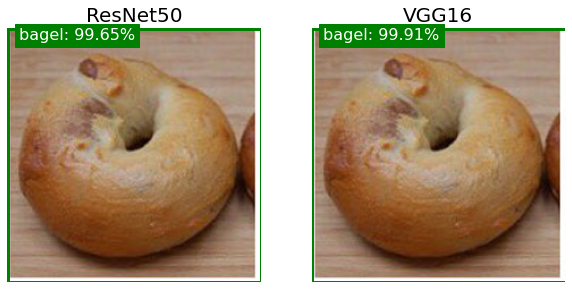
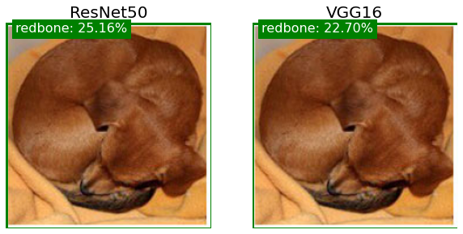
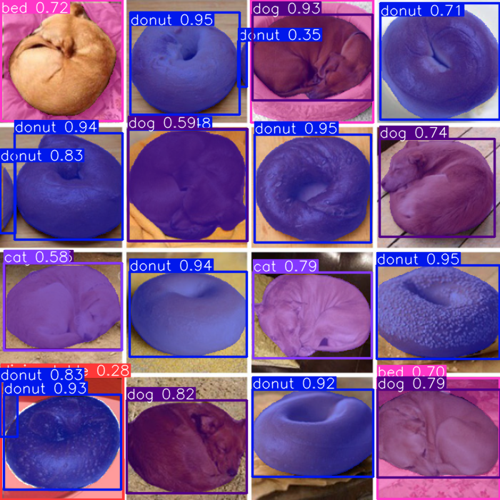
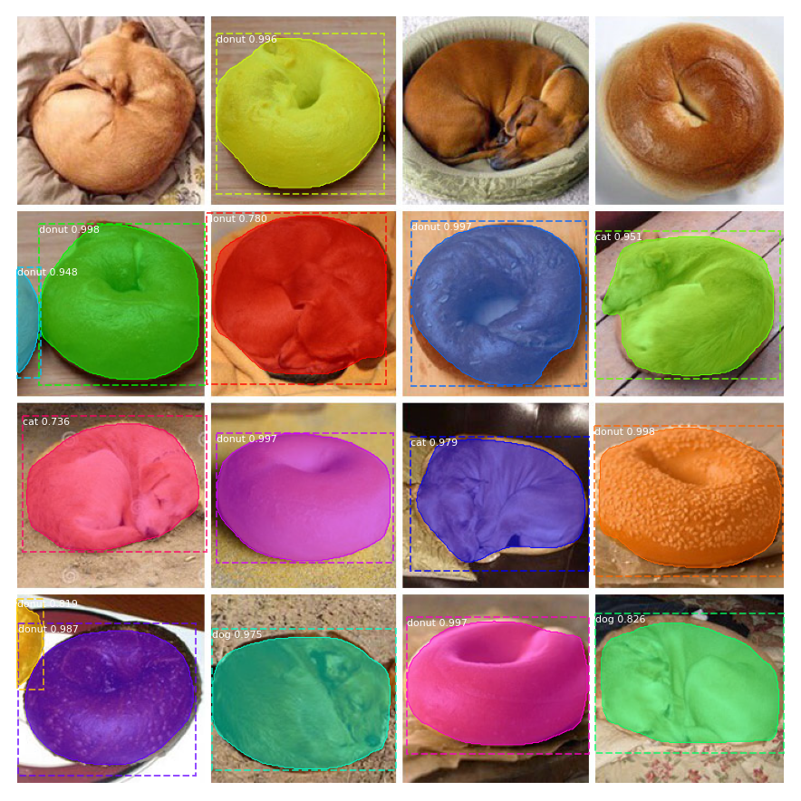

# Image Classification, Object Detection and Segmentation

This repository contains applications of state-of-the-art models for Image Classification, Object Detection and Segmentation.

## Table of Contents
- [Image Classification, Object Detection and Segmentation](#image-classification-object-detection-and-segmentation)
  - [Table of Contents](#table-of-contents)
  - [Image Classification](#image-classification)
    - [ResNet-50](#resnet-50)
    - [VGG16](#vgg16)
  - [Object Detection](#object-detection)
    - [YOLOv8](#yolov8)
  - [Segmentation](#segmentation)
    - [YOLOv8](#yolov8-1)
    - [Mask R-CNN](#mask-r-cnn)
  - [Usage](#usage)

## Image Classification
Image classification represents the most straightforward among the three tasks and entails the categorization of an entire image into one of several predetermined classes. The outcome of an image classifier consists of a sole class label paired with a confidence score. Image classification serves as a valuable tool when the objective is solely to ascertain the class to which an image pertains, without necessitating information about the precise spatial distribution or specific geometric attributes of objects within that class.

### ResNet-50

ResNet-50 is a powerful convolutional neural network (CNN) architecture that has shown remarkable performance in image classification tasks. It is a 50-layer deep neural network known for its residual connections, which help mitigate the vanishing gradient problem and enable training of very deep networks.

### VGG16

VGG16 is another popular CNN architecture known for its simplicity and effectiveness in image classification. It consists of 16 layers, including convolutional and fully connected layers, and has been widely used in various computer vision tasks.

<p align="center"></p>
<p align="center"></p>


## Object Detection
Object detection is a fundamental task encompassing the identification of objects within images or video streams, discerning their precise location and class. The outcome of an object detector typically comprises a collection of bounding boxes that encapsulate objects in the visual content, accompanied by class labels and confidence scores for each bounding box. Object detection serves as a valuable solution for scenarios in which it is necessary to recognize objects within a scene without requiring precise positional information or detailed shape analysis.

### YOLOv8

YOLOv8, short for "You Only Look Once version 8," is a state-of-the-art real-time object detection system. It is known for its speed and accuracy in detecting objects in images and videos. YOLOv8 combines the strengths of previous YOLO versions and leverages modern deep learning techniques.

<p align="center"></p>

## Segmentation
Instance segmentation extends beyond object detection, encompassing the task of identifying individual objects within an image and delineating them from the surrounding context. The outcome of an instance segmentation model encompasses a collection of masks or contours that precisely delineate each object present in the image, in addition to providing class labels and confidence scores for each recognized object. Instance segmentation proves valuable when the objective is to obtain detailed information regarding the exact spatial distribution and specific geometric attributes of objects within the image.

### YOLOv8

YOLOv8 can also be used for instance segmentation. The model can be trained to detect and segment objects in images and videos. The output of the model consists of bounding boxes and masks for each object in the image.

<p align="center"></p>

### Mask R-CNN

Mask R-CNN is a deep learning model for object detection and instance segmentation. It not only identifies objects in an image but also provides pixel-level segmentation masks for each object. This makes it suitable for tasks that require precise object localization. Mask R-CNN is an extension of Faster R-CNN, which is a popular object detection model. Mask R-CNN adds a branch to Faster R-CNN that predicts segmentation masks for each instance of the object in the image.

<p align="center"></p>

## Usage
To run the code, first clone the repository:
```bash
git clone https://github.com/mbar0075/Image-Classification-Object-Detection-and-Segmentation.git
```

Then, create the following environments:
```bash
conda env create -f yolov8.yml
conda env create -f maskrcnn.yml
```

Finally, activate the environments depending on the required application:
```bash
conda activate yolov8
conda activate maskrcnn
```

[def]: #image-classification-and-object-detection